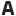
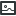
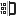
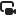

Media
=====

.. toctree::
   :hidden:

   blender
   kdenlive-import
   manim

Import media
------------

Move the playhead to the desired start time, then select the destination track.
Click |add| **Add** in that track's controls and choose |import| **Import
Media…** or **Import Captions…**. The file is inserted at the playhead on the
track whose menu you opened. If that track is part of a multi-track selection,
the import targets all selected tracks of the same type.

Video and audio files can only be imported to video or audio tracks. WebVTT
files can only be imported to caption tracks. MKV and WebM files dropped onto
the timeline can be losslessly remuxed to MP4 first; they cannot be imported
directly from a track's add menu.

Supported formats
~~~~~~~~~~~~~~~~~

Shrimply recognizes these source types:

.. list-table::
   :widths: 25 75
   :header-rows: 1

   * - Type
     - Formats
   * - Video
     - MP4, MOV, MKV, and WebM
   * - Images and documents
     - JPEG, PNG, WebP, AVIF, GIF, SVG, and PDF
   * - Audio
     - AAC, AIFF, ALAC, FLAC, M4A, MP3, Ogg, Opus, and WAV
   * - Captions
     - WebVTT
   * - Layered images
     - PSD and Krita
   * - 3D content
     - OBJ, GLB, and PLY
   * - Application sources
     - :doc:`Blender <blender>` ``.blend`` files and :doc:`Python Manim
       scenes <manim>`

Project opening additionally accepts native Shrimply projects, Shrimply JSON,
OpenTimelineIO, and :doc:`Kdenlive projects <kdenlive-import>`.

Create media
------------

Move the playhead to an empty point on the destination track and click |add|
**Add**. The new item starts at the playhead, uses the default visual duration,
and ends early rather than overlapping the next item.
Nothing is created if the playhead is already inside an item on that track.

On a video track, the menu provides:

.. list-table::
   :widths: 8 92
   :header-rows: 1

   * - Icon
     - Description
   * - |text|
     - **Text** creates a text layer using the default font.
   * - |shape|
     - **Shape** creates a vector shape. Rectangle, ellipse, triangle, star,
       arrow, diamond, polygon, heart, and cross shapes are available in the
       inspector.
   * - |paint|
     - **Paint** creates a layer for drawing strokes directly on the canvas.
   * - |background|
     - **Background** creates a full-canvas background layer.
   * - |scene-3d|
     - **3D Scene** creates a scene that can contain shapes, text, models,
       lights, and a ground plane.
   * - |video-generation|
     - **Video Generation** creates an AI video-generation item. This requires the
       :doc:`Shrimply server <../server/index>`.

On an audio track, the menu provides:

.. list-table::
   :widths: 8 92
   :header-rows: 1

   * - Icon
     - Description
   * - |text-to-speech|
     - **Text to Speech** creates an item that generates speech from text using
       the Shrimply server.
   * - |audio-generator|
     - **Audio Generator** creates a procedural audio item configured in the
       inspector.

Text to Speech and Video Generation are backed by AI models and require the
:doc:`Shrimply server <../server/index>`.

Record content
--------------

* On a video track, click |screen-recording| **Screen Recording**, choose a
  screen or application in the system capture dialog, and click the same button
  again to stop. The recording starts at the playhead and stops before the next
  item on the track.
* On an audio track, click |microphone| **Microphone** to start recording from
  the default microphone. Click the same button again to stop.

The active recording button turns red. Recording advances playback and places
the finished item on that track at the original playhead position. Start from
an empty point so the recording does not overlap an existing item.
