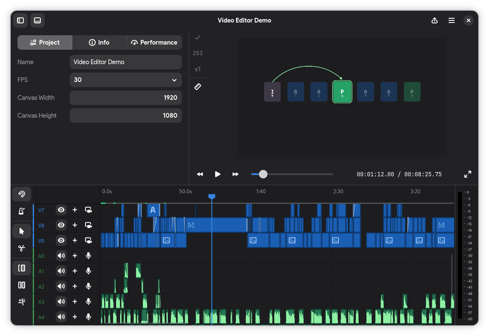

Shrimply Documentation
======================

Shrimply brings your ideas to life.

Shrimply is a free and open-source video editor for creating videos from start
to finish, whether you are making a quick edit or something fancy.

Start here
----------

* :doc:`Getting started <getting-started>` explains how to launch Shrimply,
  create a project, edit the timeline, and export it.
* :doc:`Editor <guides/editor>` describes the main workspaces and shortcuts.
* :doc:`Importing and creating media <guides/media>` lists accepted sources
  and the content Shrimply can generate.
* :doc:`Manim <guides/manim>` explains how to use Python animation scenes and
  expose their values in the inspector.
* :doc:`Expressions <guides/expressions>` covers values and functions for
  procedural and audio-reactive properties.
* :doc:`Compute server <server/index>` covers optional AI and compute features.
* :doc:`MCP integration <integrations/mcp>` documents live editor automation.
* :doc:`Development <development>` contains the supported repository workflow.

.. toctree::
   :maxdepth: 2
   :hidden:
   :caption: Contents

   getting-started
   guides/editor
   guides/media
   guides/kdenlive-import
   guides/manim
   guides/effects
   guides/expressions
   guides/audio-captions
   guides/export
   server/index
   integrations/mcp
   development
   licenses
